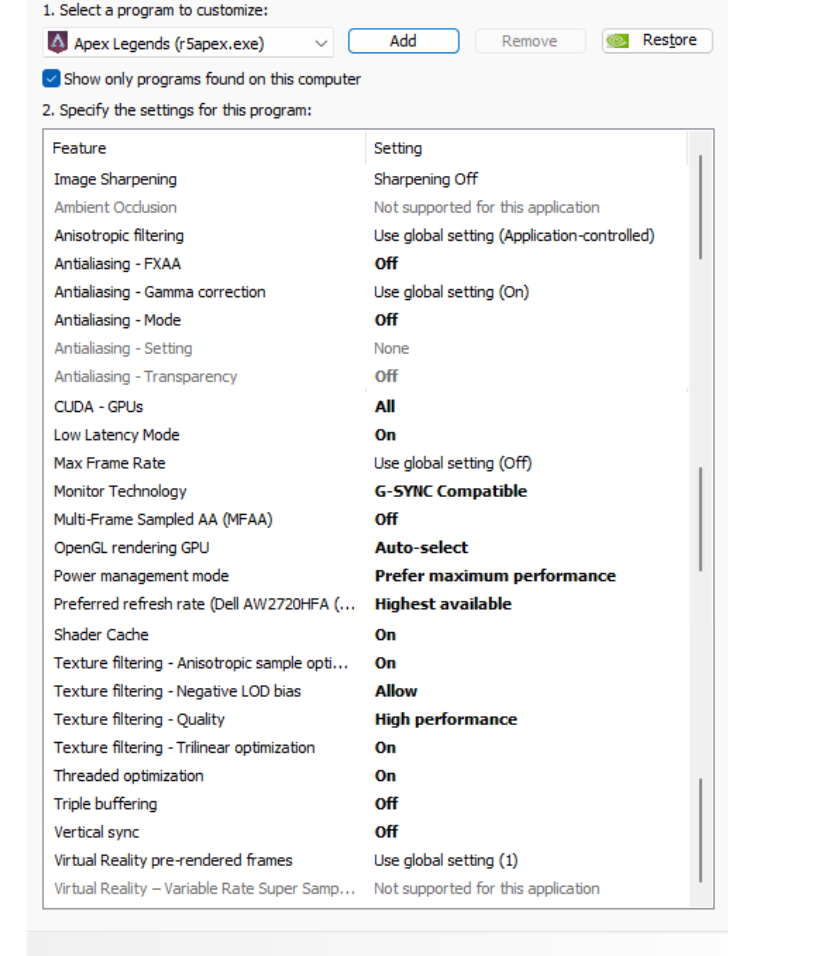

# My Apex Legends config

## Path:

### autoexec.cfg if you installed on default drive:

`%ProgramFiles(x86)%\Steam\steamapps\common\Apex Legends\cfg`

### videoconfig.txt

`%UserProfile%\Saved Games\Respawn\Apex\local`

**!! make sure file is readonly !!**

## Launch Options:

`+exec autoexec.cfg +fps_max 0 -dev -refresh 240 -high`

## Nvidia Control Settings:

### Note:

This config is inspired by this guy @deaFPS [Link to his repo](https://github.com/deaFPS/apex-configs-by-deafps) and @kretz1x [Link to his repo](https://github.com/kretz1xD/Apex-Legends-Tweaks)

Thanks for your awsome work.
